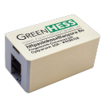

# ADA P1 Meter Integration for Home Assistant (Modded by LEWFPV)


This is a custom integration for [Home Assistant](https://www.home-assistant.io/) that provides sensor data from an ADA P1 Meter, including total energy consumption, phase voltage, current, power factors, and more.

## Features

- **Total Imported and Exported Energy** (active and reactive)
- **Voltage and Current for Each Phase (L1, L2, L3)**
- **Instantaneous Power** (imported and exported)
- **Power Factor and Frequency**

## Installation

### HACS Installation (Recommended)
1. Add this repository to HACS as a custom repository.
2. Search for "ADA P1 Meter" in the HACS store and install it.
3. Restart Home Assistant.

### Manual Installation
1. Download the files from this repository.
2. Place them in your Home Assistant `custom_components/ada12` directory.
3. Restart Home Assistant.

## Configuration

To configure the integration:
1. Go to **Settings** > **Devices & Services** > **Add Integration**.
2. Search for "ADA P1 Meter" and enter the connection details (e.g., hostname and port).
3. The integration will create sensors for each available measurement from the meter.

## Supported Sensors

- **Total Imported Energy** (kWh)
- **Total Exported Energy** (kWh)
- **Voltage for Phase L1, L2, L3** (V)
- **Current for Phase L1, L2, L3** (A)
- **Power Factor**
- **Frequency** (Hz)
- And more...

## Troubleshooting

If you encounter any issues, please check the Home Assistant logs under **Settings** > **Logs**. For more help, create an issue in this repository.

---

## Notes on mDNS and `.local` Domains

Issues with mDNS and `.local` domain resolution may occur on certain systems. This can lead to problems when the integration attempts to connect to devices using a `.local` domain. If you encounter this issue, there are a few options to resolve it:

1. Use the device's IP address instead of the `.local` domain.
2. Set up a local DNS server to resolve `.local` domains within your network.

To address this issue manually in the code, locate the following section in the `__init__.py` file of the integration:

```python
"""Fetch JSON data from the okosvillanyora.local server."""
url = "http://okosvillanyora.local:8989/json"
```

Replace the .local domain with the device's IP address, as shown below:

```python
"""Fetch JSON data from the okosvillanyora.local server."""
url = "http://<ADA_DEVICE_IP>:8989/json"
```

After making this change, restart Home Assistant to apply the updates.

---

## License

This project is licensed under the MIT License.

 

## Saját fejlesztés

Ez az én forkomban hozzáadott új rész.
